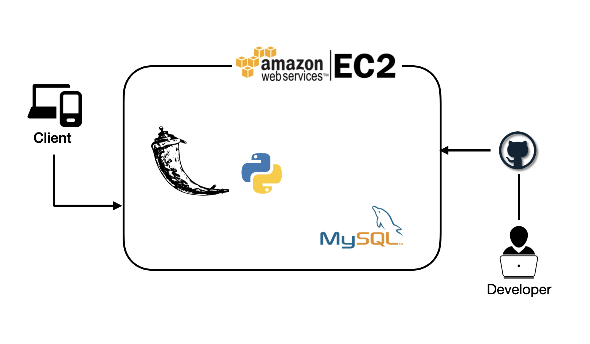
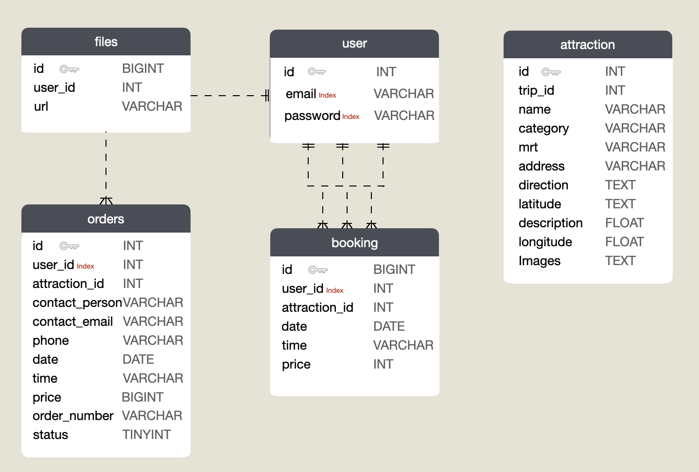

# Taipei-day-trip
## DEMO  

  
  

[Main Features](#main-features)  
[Backend Technique](#backend-technique)
- [Enviroment](#environment)  
- [Database](#database)
- [Cloud Services](#cloud-services)  
- [Version Control](#version-control)  

[Frontend Technique](#frontend-technique)  
[Third-party](#third-party)  
[Architecture](#architecture)  
[Database Schema](#database-schema)

## Main Features  

- Member system, login and signup(bcrypt).
- Use keyword to search for related attractions.
- Responsive Web Design.
- Infinite scroll.  

- Online payment system with Tappay.
- Review order history.
- MVC

## Backend Technique

### Environment
- Python
  - dotenv 
  - The member passwords are encrypted using **bcrypt**. User identity is verified using **JWT**.
- Use **Flask** as the server framework with the MVC architecture.  
- Use **Blueprint** to modulize code, making development more clear, organized, and easy to maintain.

### Database
- Implement connection pool with normalized **MySQL** & set Member profile index.
### Cloud Services
- AWS EC2
### Version Control
- Git / GitHub

## Frontend Technique

- HTML
- CSS
- Use  **Javascript** to build infinite Scroll, Lazing Loading and photo carousel.   
## Third-party

- Adapt Third-Party Payment System, the **TapPay**.

## Architecture

- Server Architecture

## Database Schema

